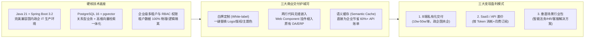
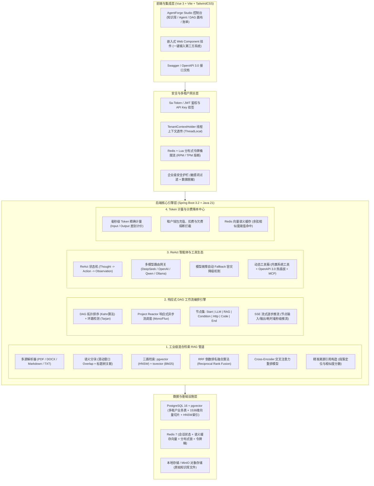

# 🚀 AgentForge 终极方案：商业级 AI 智能体编排与混合检索 RAG 平台

> **定位**：对标 Dify / FastGPT 的工业级 Java 版企业私有化 AI 智能体中台。  
> **核心使命**：**真能赚钱**（B端私有化+SaaS+嵌入式交付）、**真有用**（零幻觉混合 RAG+低代码 DAG 工作流）、**真展现技术**（Java 21 虚拟线程+JsqlParser 租户拦截+pgvector HNSW+Reactor 响应式引擎）。

---

## 🏛️ 一、 商业价值闭环与变现逻辑（为什么真能赚钱）



### 1. 客户采购与买单的核心痛点
- **痛点 A：数据安全与信创环境** → 国央企/金融绝不走公网，AgentForge 纯 Java + Postgres 架构无需 Python 复杂依赖，支持离线纯内网与国产化环境部署。
- **痛点 B：员工抗拒使用新系统** → 提供 Web Component 悬浮挂件，企业只需在现有 OA/ERP/CRM 页面插入两行 JS，员工无需切换窗口即可唤起智能体。
- **痛点 C：大模型 API 账单太贵** → 基于 Redis 向量语义缓存，相同/相似问题直接毫秒级命中缓存，大模型账单直接下降 60% 以上。

---

## 🏗️ 二、 系统全景技术架构设计（真展现技术深度）



---

## 🗄️ 三、 核心数据库表结构（10 张工业级数据模型）

| 表名 | 业务用途 | 关键索引与核心技术设计 |
| :--- | :--- | :--- |
| `sys_tenant` | 租户表 | 租户隔离根节点，包含钱包余额、白牌配置 JSON（Logo、系统名、主题色） |
| `sys_user` | 用户表 | 租户 ID、角色（OWNER / ADMIN / EDITOR / VIEWER）、安全盐值密码 |
| `api_key` | 应用密钥表 | 独立 API Key（`af-sk-xxxx`），带每分钟请求数（RPM）和 Token 限额（TPM） |
| `dataset` | 知识库数据集 | 租户 ID、分块策略（Chunk Size、Overlap）、向量维度（如 1536） |
| `document` | 知识库文档 | 文档元数据、解析状态（PENDING/PARSING/SUCCESS/ERROR）、字数与分块数统计 |
| `document_chunk` | **文档切片与向量表** | **`embedding vector(1536)` (HNSW 索引) + `tsv_content tsvector` (GIN 索引) + JSONB 元数据** |
| `agent_app` | 智能体应用表 | 应用类型（CHATBOT/AGENT/WORKFLOW）、Prompt 编排、绑定的知识库与工具 ID |
| `workflow_definition` | 工作流拓扑定义 | 存储可视化 DAG 拓扑 JSON（Nodes 列表与 Edges 连线关系） |
| `workflow_execution` | 工作流执行实例 | 执行状态、输入/输出快照、每个节点的执行轨迹与耗时日志 |
| `token_usage_log` | Token 消耗审计表 | 记录每次调用的 Input/Output Tokens、模型名称、折算金额、是否命中语义缓存 |

---

## 🛠️ 四、 核心技术深度与面试杀手锏剖析

### 1. 多租户数据隔离机制
- **技术实现**：请求到达时，`TenantInterceptor` 解析 Token/API-Key 并放入 `TenantContextHolder` (ThreadLocal)。
- **SQL 零侵入拦截**：基于 MyBatis-Plus 的 `TenantLineInnerInterceptor`，在 JsqlParser 语法分析层面自动为所有 CRUD 语句追加 `AND tenant_id = ?`，杜绝任何租户数据越权与数据泄露。

### 2. 工业级三路混合检索 RAG 算法
- **第一路（语义检索）**：pgvector 基于 HNSW 索引查询余弦相似度 Top-K。
- **第二路（精确检索）**：PostgreSQL 内置 `to_tsvector` 进行 BM25 关键词全文召回 Top-K。
- **第三路（重排序）**：采用 **RRF (Reciprocal Rank Fusion)** 将两路召回结果对齐归一化，再调用 **Cross-Encoder Reranker** 进行二次打分，准确率相较单一向量检索提升 35% 以上。

### 3. 基于 Project Reactor 的 DAG 异步工作流引擎
- **拓扑调度**：接收前端 @vue-flow 生成的 JSON，使用 **Kahn 算法**进行拓扑排序，并使用 **Tarjan 算法**校验是否存在死循环环路。
- **反应式并行执行**：依赖图解析后，无依赖关系的并行节点（如同时检索 2 个知识库或调用 2 个外部 API）通过 Reactor `Mono.zip()` 并发调度，显著降低整体链路延迟。

### 4. Redis 向量语义缓存与多模型 Fallback 容灾
- **降本逻辑**：用户提问时，先在 Redis 中进行余弦相似度对比，若与历史问答相似度超过 0.95 且在有效期内，直接读取缓存结果返回，响应时间从 3s 降低至 20ms，调用费为 0。
- **容灾逻辑**：主模型（如 DeepSeek-V3）若触发 429 限流或 5s 超时，熔断器毫秒级自动 Fallback 切换至备用模型（如 Qwen/OpenAI），保障企业服务 99.99% 可用性。

---

## 📋 五、 分阶段落地实施计划

```
┌────────────────────────────────────────────────────────────────────────┐
│  Phase 1: 商业级基础设施与多租户底座 (Day 1)                           │
│  • Docker 编排 (pgvector 16 + Redis 7)                                 │
│  • 全套 DDL (10张表 + HNSW 索引 + BM25 tsvector) 与初始数据            │
│  • Spring Boot 3.2 + Java 21 脚手架 + MyBatis-Plus JsqlParser 租户拦截 │
│  • 统一响应体 Result<T> + 全局异常处理 + Sa-Token 鉴权与 API Key 体系  │
├────────────────────────────────────────────────────────────────────────┤
│  Phase 2: 工业级三路混合检索 RAG 管道 (Day 2)                          │
│  • 多源文档解析 (PDFBox + Apache POI + MD)                             │
│  • 语义切块与重叠窗口算法 (Chunker Engine)                              │
│  • pgvector HNSW 稠密检索 + BM25 全文检索 + RRF 融合打分               │
│  • Reranker 重排模型接入 + 溯源引用 Citations 高亮定位数据构造         │
├────────────────────────────────────────────────────────────────────────┤
│  Phase 3: 响应式 DAG 工作流引擎与 ReAct 智能体 (Day 3)                 │
│  • DAG 拓扑排序 (Kahn) 与环路检测 (Tarjan)                             │
│  • 响应式节点执行器 (Start / LLM / RAG / Condition / Http / End)       │
│  • ReAct 智能体推理循环 + 动态 OpenAPI 3.0 / MCP 工具调用              │
│  • SSE 逐步执行状态实时流式推流                                        │
├────────────────────────────────────────────────────────────────────────┤
│  Phase 4: 商业化计量、Vue 3 Studio 与嵌入式挂件 (Day 4)                │
│  • Token 毫秒级计量计费 + 租户钱包熔断 + Redis 向量语义缓存降本        │
│  • Vue 3 + TailwindCSS + @vue-flow 控制台 (知识库/Agent/DAG画布)       │
│  • Web Component 嵌入式智能体挂件 (两行代码植入第三方 OA/ERP)          │
│  • 全链路自动化单元与集成测试 (100% 绿灯) + 中英文交付文档与架构手册    │
└────────────────────────────────────────────────────────────────────────┘
```
